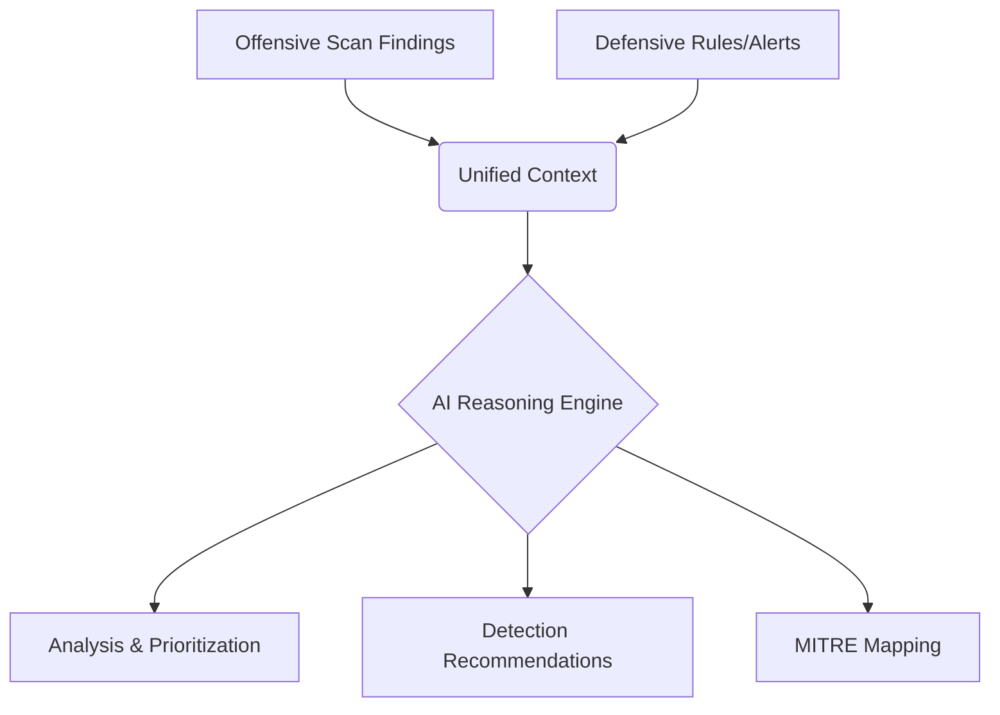

# Purple Team Copilot Architecture

## Vision
To transform the tool from a simple scanner runner into an **AI-Powered Purple Team SaaS**.
The core value is **Reasoning** over the data, not just generating it.

## Core Modules

### 1. Offensive Engine (The "Hands") 🛠️
Already implemented via `tools-api`.
- Nmap, SearchSploit, Wapiti, OpenVAS.
- Raw outputs: XML, JSON, Text.

### 2. Defensive Engine (The "Eyes") 🛡️
Already implemented via `Dashboard`.
- Live alerts, System health, Network traffic.

### 3. Sentinel Brain (The "Mind") 🧠  <-- NEW
This is the **Purple Team Copilot**. 
It bridges the gap between findings and defense.

#### Architecture

## Implementation Plan (Purple Team Copilot)

### Phase 1: Reasoning Engine Setup (Python)
- **File:** `tools-api/purple_brain.py`
- **Function:** Parsing raw tool output (e.g., Nmap XML) and mapping it to a "Risk Context".
- **Logic:**
    - *If* Port 445 Open --> *Map to* T1021 (Remote Services).
    - *Risk:* High (Possible Ransomware/SMB entry).
    - *Defense:* "Ensure SMB signing is enabled and port blocked at firewall."

### Phase 2: React integration
- **Component:** `SentinelTerminal.tsx`
- **Feature:** "Copilot Mode".
- Instead of just `Job Finished`, the Terminal types out:
    > "Scan complete. I detected Port 445 is open. This aligns with **MITRE T1021**. RECOMMENDATION: Verify Alert #1054 in your SIEM."

## Immediate Next Step
- Create `purple_brain.py` in `tools-api`.
- Connect `nmap_exploit_scan` to feed its output to `purple_brain`.
- Return the "Reasoning" object along with the raw scan output.
